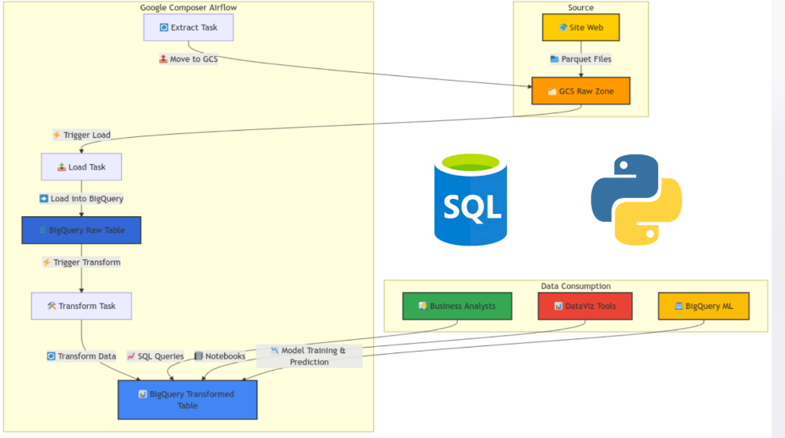

# 🚀 Plateforme Data Cloud GCP — Analyse & Prédiction de Trajets

## 📌 Contexte

Ce projet consiste en la conception et la mise en place d’une **plateforme data cloud scalable** permettant d’exploiter plusieurs millions de trajets de taxis.

L’objectif est de transformer des données brutes en informations exploitables pour :
- analyser la demande et la saisonnalité  
- comprendre le comportement client  
- optimiser la rentabilité des trajets  
- préparer des modèles de prédiction  

---

## ❗ Problématique

Les données de trajets sont :
- massives (plusieurs millions de lignes)  
- hétérogènes (formats variés, fichiers Parquet)  
- difficiles à exploiter sans pipeline structuré  

➡️ Sans architecture adaptée :
- pas de vision métier claire  
- difficulté d’analyse  
- impossibilité de passer à l’échelle  

---

## 💡 Solution

Mise en place d’une **architecture data end-to-end sur GCP** :

### 🔄 Pipeline de données

1. **Extraction**
   - Sources : fichiers Parquet (données taxis)
   - Orchestration via **Airflow (Cloud Composer)**

2. **Stockage brut**
   - Data Lake sur **Google Cloud Storage (GCS - Raw Zone)**

3. **Chargement**
   - Ingestion vers **BigQuery (Raw Tables)**

4. **Transformation**
   - Traitement SQL + Python
   - Nettoyage, enrichissement, déduplication
   - Gestion des chargements incrémentaux

5. **Stockage transformé**
   - Tables analytiques dans **BigQuery**

6. **Consommation**
   - DataViz (Power BI / outils BI)
   - Analyse métier
   - Machine Learning (**BigQuery ML**)

---

## 🏗️ Architecture

---

## ⚙️ Stack Technique

- **Cloud** : GCP (Cloud Storage, BigQuery, Cloud Composer)
- **Orchestration** : Apache Airflow
- **Langages** : Python, SQL
- **Data Processing** : BigQuery
- **Formats** : Parquet
- **Machine Learning** : BigQuery ML (notions)

---

## 🔥 Fonctionnalités clés

- ✅ Pipelines ETL/ELT automatisés  
- ✅ Ingestion de données volumineuses  
- ✅ Chargements incrémentaux  
- ✅ Détection et suppression des doublons  
- ✅ Monitoring & logging des pipelines  
- ✅ Architecture scalable et industrialisée  

---

## 📊 Cas d’usage

- Analyse de la demande de transport  
- Étude de la saisonnalité  
- Analyse de rentabilité  
- Optimisation des trajets  
- Préparation à la prédiction  

---

## 📈 Impact

- Centralisation et structuration de données massives  
- Réduction du temps de traitement et d’analyse  
- Données fiables prêtes pour le décisionnel  
- Base solide pour des modèles prédictifs  

---

## 🚀 Améliorations futures

- Intégration de streaming (Pub/Sub)  
- Mise en place de Data Quality avancée  
- Déploiement de modèles ML (Vertex AI)  
- Dashboard temps réel  

---

## 👨‍💻 Auteur

**Birane SEYE**  
Data Engineer | BI Consultant  

---
